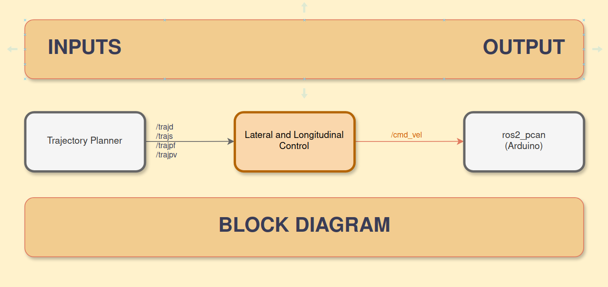
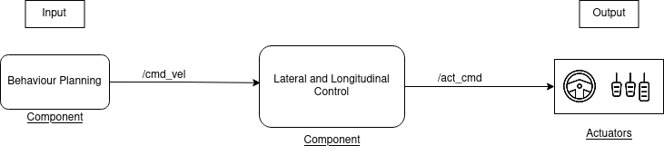

# adapt_latlongcon — Lateral and Longitudinal Control

A ROS 2 Python package implementing a **Pure Pursuit path-tracking controller** for autonomous vehicle navigation and parking. This component is part of the ADAPT autonomous driving stack and is responsible for converting planned trajectories into actuator commands (velocity and steering angle).

---

## Table of Contents

- [Overview](#overview)
- [System Architecture](#system-architecture)
- [ROS 2 Interface](#ros-2-interface)
  - [Subscribed Topics](#subscribed-topics)
  - [Published Topics](#published-topics)
  - [Parameters](#parameters)
- [Node Behaviour & State Machine](#node-behaviour--state-machine)
- [Algorithm: Pure Pursuit Controller](#algorithm-pure-pursuit-controller)
- [Code Structure](#code-structure)
- [Dependencies](#dependencies)
- [Installation](#installation)
- [Running the Node](#running-the-node)
  - [Run directly](#run-directly)
  - [Run via launch file](#run-via-launch-file)
- [Testing](#testing)
- [Known Limitations & Notes](#known-limitations--notes)
- [Maintainer](#maintainer)
- [License](#license)

---

## Overview

In the ADAPT system architecture, the vehicle's motion is governed by the **lateral and longitudinal control component**. It receives interpolated trajectories (with per-waypoint velocity information) from the upstream trajectory planner and converts them into `Twist` messages sent to the vehicle actuators.

The component supports three distinct operational modes:

| Mode | Description |
|------|-------------|
| **Drive** | Normal forward cruise from the start position to the area near a parking spot |
| **Forward Park** | Low-speed forward manoeuvre to align the vehicle for reverse parking |
| **Reverse Park** | Controlled reverse manoeuvre into the target parking spot |

An **emergency stop** mechanism is also supported via a dedicated topic.

---

## System Architecture



The node sits between the **Trajectory Planner** (`adapt_trajp`) and the **vehicle actuators**. It also depends on the **Localization** component (`adapt_loc`) to receive the ego vehicle's current pose and orientation.

```
adapt_trajp ──► /trajd, /trajpf, /trajpr, /trajps ──► adapt_latlongcon ──► /cmd_vel ──► Actuators
adapt_loc   ──► /loc_pose ────────────────────────────────────────────────►
                                                                            └──► /reach_goal ──► Behaviour Planning
                                                                            └──► /park_reverse ──► Trajectory Planner
```

---

## ROS 2 Interface

### Subscribed Topics

| Topic | Message Type | Description |
|-------|-------------|-------------|
| `/trajd` | `trajectory_msgs/JointTrajectory` | Trajectory (positions + velocities) for the **drive** state |
| `/trajpf` | `trajectory_msgs/JointTrajectory` | Trajectory for the **forward parking** state |
| `/trajpr` | `trajectory_msgs/JointTrajectory` | Trajectory for the **reverse parking** state |
| `/trajps` | `trajectory_msgs/JointTrajectory` | Trajectory with all velocities set to zero (stop state) |
| `/stop` | `std_msgs/Bool` | Emergency stop signal; publishing `True` immediately halts the vehicle |
| `/loc_pose` | `geometry_msgs/PoseStamped` | Current ego vehicle pose (position + orientation as quaternion) |

### Published Topics

| Topic | Message Type | Description |
|-------|-------------|-------------|
| `/cmd_vel` | `geometry_msgs/Twist` | Linear velocity and angular (steering) commands sent to actuators |
| `/reach_goal` | `std_msgs/Bool` | Published `True` when the vehicle arrives within 0.3 m of the drive goal, signalling Behaviour Planning to advance state |
| `/park_reverse` | `std_msgs/Bool` | Published `True` when forward parking alignment is complete, triggering the reverse parking trajectory in the Trajectory Planner |

### Parameters

| Parameter | Default | Description |
|-----------|---------|-------------|
| `look_ahead_distance` | `1.2` (metres) | Look-ahead distance used by the Pure Pursuit algorithm. Increasing this smooths the path at the cost of cut-corner accuracy; decreasing it tightens tracking but can cause oscillation. |

The parameter can be overridden at launch time:

```bash
ros2 run adapt_latlongcon pp --ros-args -p look_ahead_distance:=1.5
```

---

## Node Behaviour & State Machine

The `twist_publisher` function is called by an internal timer at **100 Hz** (`timer_period = 0.01 s`) and dispatches to the correct driving mode based on a set of boolean flags:

```
┌─────────────────────────────────────┐
│           twist_publisher()          │
│  (called at 100 Hz)                 │
└──────────────┬──────────────────────┘
               │
       ┌───────▼──────────┐
       │  e_stop == True? ├──YES──► Publish Twist(0, 0)
       └───────┬──────────┘
               │ NO
       ┌───────▼──────────┐
       │  drive == True?  ├──YES──► pure_pursuit(/trajd) → Twist(0.5, δ)
       └───────┬──────────┘         └─ near goal? → publish /reach_goal=True, reset
               │ NO
       ┌───────▼────────────────┐
       │ park_forward == True?  ├─YES─► pure_pursuit(/trajpf) → Twist(0.6, δ)
       └───────┬────────────────┘       └─ near goal? → publish /park_reverse=True, reset
               │ NO
       ┌───────▼────────────────┐
       │ park_reverse == True?  ├─YES─► Twist(-0.8, -24.62°) with yaw correction
       └───────┬────────────────┘       └─ near goal? → reset
               │ NO
       ┌───────▼──────────┐
       │     DEFAULT      │──────────► Publish Twist(0, 0)  [idle]
       └──────────────────┘
```

**State transition rules:**
- Each path callback (`path_for_drive`, `path_for_park_for`, `path_for_park_rev`) exclusively sets its own flag to `True` and all others to `False`, ensuring only one mode is active at a time.
- A state is cleared (flag set to `False`, path set to `None`) automatically once the vehicle reaches within the proximity threshold of the final waypoint.
- Emergency stop (`/stop` topic) takes highest priority and overrides all other states.

---

## Algorithm: Pure Pursuit Controller

The core steering logic is implemented in the `pure_pursuit()` method and is used for both the **drive** and **forward parking** states.

### Steps

1. **Find nearest waypoint** — using Euclidean distance from the current pose to all waypoints (`numpy` vectorised for efficiency).
2. **Find lookahead waypoint** — starting from the nearest index, advance along the path until a waypoint is found that is at least `look_ahead_distance` metres away.
3. **Compute heading error α** — the angle between the vehicle's current heading (yaw) and the direction towards the lookahead point:

   ```
   α = atan2(target_y - current_y, target_x - current_x) − current_yaw
   ```
   α is normalised to the range `[−π, π]`.

4. **Compute steering angle** — using the pure pursuit geometric formula with the vehicle's wheelbase `L = 0.5 m`:

   ```
   δ = atan2(2 · L · sin(α), look_ahead_distance)
   ```

5. **Clip output** — the steering angle is converted to degrees and clamped to `[−30°, 30°]` to respect actuator limits.

The reverse parking state uses a **hardcoded steering angle** (`angular.z = −24.62`) with a yaw-based correction: once the vehicle heading approaches 170–180° (facing backwards), the angular velocity is set to zero to straighten up.



---

## Code Structure

```
control/
├── adapt_latlongcon/
│   ├── __init__.py
│   └── path_tracking.py        # Main node: LatLongController class + main()
├── images/
│   ├── lat.png                 # Lateral control illustration
│   ├── latlongcon.png          # Full block diagram
│   └── rosgraph.png            # ROS node graph
├── launch/
│   └── latlong_launch.py       # ROS 2 launch file
├── resource/
│   └── adapt_latlongcon        # Ament resource marker
├── test/
│   ├── dummy_pub.py            # Standalone dummy Twist publisher for manual testing
│   ├── latlong_test.py         # Integration test using pytest + rclpy
│   ├── test_copyright.py       # ament_copyright linting test
│   ├── test_flake8.py          # PEP 8 / flake8 linting test
│   └── test_pep257.py          # Docstring style linting test
├── package.xml                 # ROS 2 package manifest
├── setup.cfg                   # Script install paths
├── setup.py                    # Python package setup (entry point: pp)
└── README.md
```

### Key class: `LatLongController` (`path_tracking.py`)

| Method | Purpose |
|--------|---------|
| `__init__` | Declares parameters, creates publishers/subscribers, initialises state |
| `twist_publisher` | Timer callback (100 Hz); dispatches Twist commands based on active mode |
| `path_for_drive` | Stores drive trajectory; sets `drive=True` |
| `path_for_park_for` | Stores forward-park trajectory; sets `park_forward=True` |
| `path_for_park_rev` | Stores reverse-park trajectory; sets `park_reverse=True` |
| `vehicle_pose` | Updates `current_pose` (x, y) and `current_yaw` from `/loc_pose` |
| `quaternion_to_euler` | Converts quaternion orientation to roll/pitch/yaw |
| `find_nearest_waypoint` | Vectorised nearest-neighbour search over path waypoints |
| `find_distance_index_based` | Euclidean distance from current pose to a specific waypoint by index |
| `idx_close_to_lookahead` | Walks path forward from nearest index until lookahead distance is exceeded |
| `pure_pursuit` | Full Pure Pursuit implementation; returns steering angle in degrees |
| `stop` | Emergency stop handler; zeroes all velocities and sets `e_stop=True` |

---

## Dependencies

### ROS 2 Runtime Dependencies

| Package | Purpose |
|---------|---------|
| `rclpy` | ROS 2 Python client library |
| `std_msgs` | `Bool` message type |
| `geometry_msgs` | `Twist`, `PoseStamped` message types |
| `trajectory_msgs` | `JointTrajectory`, `JointTrajectoryPoint` message types |
| `ros2launch` | Launch system |

### Python Libraries

| Library | Purpose |
|---------|---------|
| `numpy` | Vectorised distance calculations |
| `math` | Trigonometric functions, `atan2`, `sqrt`, `degrees` |

### System / ADAPT Stack Dependencies

| Package | Role |
|---------|------|
| `adapt_trajp` | Trajectory Planner — publishes `/trajd`, `/trajpf`, `/trajpr` |
| `adapt_loc` | Localization — publishes `/loc_pose` |

### Test Dependencies

- `ament_copyright`
- `ament_flake8`
- `ament_pep257`
- `python3-pytest`

---

## Installation

> **Prerequisites:** ROS 2 (Humble or later) must be installed and sourced.

### Step 1: Create a workspace

```bash
mkdir -p ~/ros2_ws/src
cd ~/ros2_ws/src
```

### Step 2: Clone the repository

```bash
git clone https://git.hs-coburg.de/ADAPT/adapt_latlongcon.git
```

### Step 3: Build the package

Navigate back to the workspace root and build using `colcon`:

```bash
cd ~/ros2_ws
colcon build --symlink-install
```

`--symlink-install` links Python source files instead of copying them, so edits to `.py` files take effect without a rebuild.

### Step 4: Source the workspace

```bash
source install/setup.bash
```

Add this line to your `~/.bashrc` to source automatically on every new terminal:

```bash
echo "source ~/ros2_ws/install/setup.bash" >> ~/.bashrc
```

---

## Running the Node

### Run directly

The entry point is registered as `pp`:

```bash
ros2 run adapt_latlongcon pp
```

To override the look-ahead distance parameter:

```bash
ros2 run adapt_latlongcon pp --ros-args -p look_ahead_distance:=1.5
```

### Run via launch file

```bash
ros2 launch adapt_latlongcon latlong_launch.py
```

The launch file starts the node under the name `path_tracking` within the `adapt_latlongcon` package.

---

## Testing

### Run all tests

From the workspace root:

```bash
colcon test --packages-select adapt_latlongcon
colcon test-result --verbose
```

### Run with pytest directly

```bash
cd ~/ros2_ws
pytest src/adapt_latlongcon/test/
```

### Test descriptions

| Test file | What it tests |
|-----------|---------------|
| `latlong_test.py` | Integration test: spins up `LatLongController`, publishes a synthetic straight-line trajectory, and verifies that a non-zero `Twist` is published on `/cmd_vel` |
| `dummy_pub.py` | Manual helper: standalone node that continuously publishes a dummy `Twist(linear.x=1.2, angular.z=0.5)` on `cmd_vel` for manual integration checks |
| `test_copyright.py` | Checks all source files carry a valid copyright header (ament_copyright) |
| `test_flake8.py` | Enforces PEP 8 code style via flake8 |
| `test_pep257.py` | Enforces PEP 257 docstring conventions |

---

## Limitations & Notes

- **Reverse parking uses a hardcoded angular velocity** (`-24.62 rad/s`) rather than Pure Pursuit. This is calibrated for a specific vehicle geometry and parking scenario and may require tuning for different environments.
- **Wheel base is hardcoded** at `0.5 m` inside `__init__`. This should ideally be a ROS 2 parameter.
- **Linear velocities are hardcoded** per mode (`0.5` for drive, `0.6` for forward park, `-0.8` for reverse). These are not exposed as parameters.
- **Proximity thresholds** for goal detection (`0.3 m` for drive/forward-park, `0.2 m` for reverse-park) are hardcoded.


---


## License

Apache License 2.0 — see [LICENSE](LICENSE) for details.