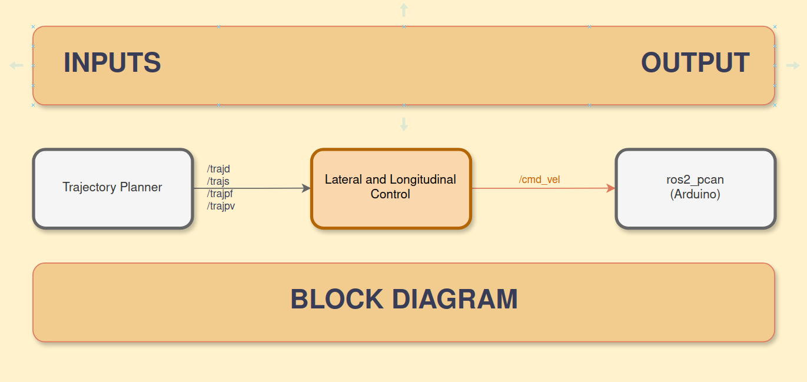

## Component Description
In our system architecture, the vehicle's movement is controlled by the lateral and longitudinal component. It subcribes to the trajectory planner which gives an interpolated trajectory along with velocity information for each waypoint and the parking path. The component use a pure pursuit controller to track the route and effectively follow it with simultaneous calculations of the angular velocity. 


| In/Out | Topic Name| Message Type | Description | 
| --------- | ---------- | ---------- | ----------- |
| Input | /trajd |JointTrajectory | trajectory with positions and associated velocities for drive state |
| Input | /trajpf |JointTrajectory | trajectory with positions and associated velocities for forward parking state |
| Input| /trajpr |JointTrajectory | trajectory with positions and associated velocities for reverse parking state|
| Input| /trajps |JointTrajectory | trajectory with positions and associated velocities set to zero |
| Input| /stop | Bool | emergency stop |
| Output | /cmd_vel | Twist | speed and steering angle commands to the actuators |
| Output | /reach_goal | Bool | sent true to the behaviour planning to change the state further |
| Output | /park_reverse | Bool | send true to the trajectory planner to trigger the reverse state |

## Lateral and Longitudinal Control Block Diagram

 

## Functionality
The adapt_latlongcon components takes three inputs from trajectory planner namely for drive, parking forward, parking reverse.

The functions are as follows:
1. The functions path_for_drive(), path_for_park_for(), path_for_park_rev(), stores the trajectorys of the respective topics and set the appropriate flags to true or false
2. The functions vehicle_pose() stores the ego vehicle's current position and orientation
3. The pure_pursuit() function implements the logic for the path tracking algorithm to calculate the angular velocity.
4. The stop() functions set the Twist message to 0.0 for effectively braking the ego vehicle.
5. The twist_publisher() function use the set flags to determine the current condition, fill the messsage and execute the publisher.


## Dependencies
1. adapt_trajp
2. adapt_loc

## Setup

## Installation Instructions

To install the Lateral and Longitudinal Control package, do follow the steps below:

### Step 1: Create a worksapce

Open the terminal, navigate to the worksapce and create a 'src' directory where you want to clone the repository. 

```shell
mkdir src
```
### Step 2: Clone the Repository
Navigate to 'src' and follow the given command to clone the repository.
```shell
git clone https://git.hs-coburg.de/ADAPT/adapt_latlongcon.git
```
### Step 3: Build the Package
After cloning the repository, navigate back to the workspace
```shell
cd ..
```
Now, build the package using **`colcon`**:
```shell
colcon build --symlink-install
```
### Step 4: Source the setup file
Once the build is complete, you'll need to source the workspace to make it available to ROS2:
```shell
source install/setup.bash
```
### Step 5: Now Run the Node
You can now launch the Lateral and Longitudinal Control node:
The entry point for Lateral and Longitudinal Control is **`pp`**.
```shell
ros2 run adapt_latlongcon pp
```
