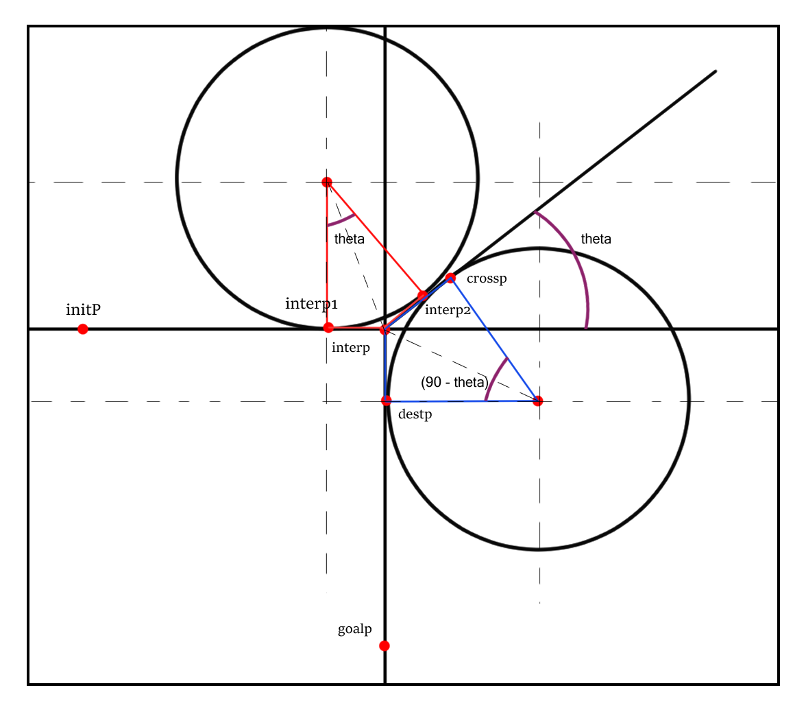

#  Trajectory

## Overview

The **Trajectory** module takes the raw waypoint path produced by the **Route Computer** and transforms it into a smooth, physically drivable trajectory. It also computes the precise geometry needed to execute the final **parking maneuver**.

By applying **cubic spline interpolation**, the module eliminates sharp angular transitions between waypoints, producing a path the vehicle can follow comfortably at speed.

---

## Responsibilities

- Receive the raw route from the Route Computer
- Apply **cubic spline interpolation** to smooth the path
- Compute the **parking maneuver** geometry using circle arcs and line segments
- Publish the final smooth trajectory for the Control module

---

## How It Works

```
Route Computer
      │  raw waypoints
      ▼
Trajectory Planner
  ┌─────────────────────────────────────────┐
  │  Cubic Spline Interpolation             │  →  smooth driving path
  │  Parking Maneuver Geometry              │  →  arc + line segment sequence
  │    (circles & line segments)            │
  └─────────────────────────────────────────┘
      │
      ▼
  /trajectory  →  Control (Lateral & Longitudinal)
```

### Cubic Spline Interpolation
Raw routes from path planners consist of discrete waypoints which, when followed directly, produce jerky motion. Cubic splines fit a smooth curve through all waypoints, resulting in natural, continuous vehicle motion.

### Parking Maneuver
The final approach and parking sequence is computed geometrically using **circular arcs** (for turning) combined with **straight line segments** (for alignment), giving the vehicle a clean, repeatable parking path even in tight spots.

## The parking maneuver concept



The parking is designed in five phases:-

1. forward straight(initp and interp2)
2. forward circle(interp1 to interp2)
3. forward straight(interp2 to crossp)
4. reverse circle(crossp to destp)
5. reverse straight(destp to goalp)

The design include the use of two circles with same radius and line drawn form interp at an angle of theta, both of the circles have one tangent at the line and one tangent on vertical and horizontal lines respectively. the first circle arc is formed between the tangents of the first circle and second arc between the tangents of the second circle. 
---

## ROS 2 Interface

| Direction | Topic | Type | Description |
|---|---|---|---|
| Subscribed | `/route` | custom | Raw waypoint route from Route Computer |
| Published | `/trajectory` | custom | Smoothed trajectory for the Control module |

> Topic names may vary — refer to source code for exact topic strings.

---

## Dependencies

- ROS 2 Foxy
- `scipy` or equivalent — for cubic spline computation
- ADAPT Route Computer (`adapt_roucomp`)
- ADAPT Messages (`messages`)

---

## Related Components

- **Route Computer** — provides the raw route to be smoothed
- **Control** — receives the final trajectory and executes it on the vehicle
- **Behaviour Planning** — monitors the trajectory execution state


ros2 run adapt_trajp traj
```
