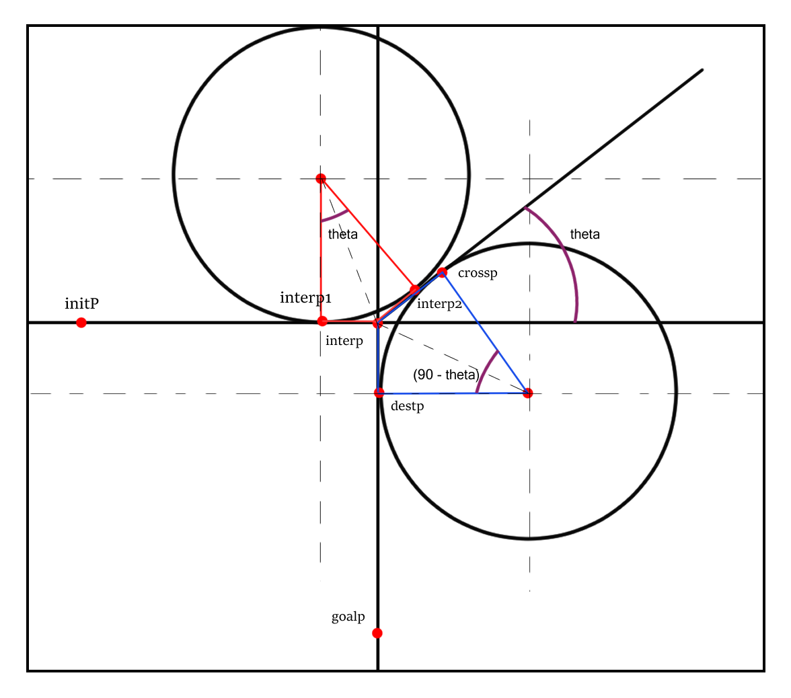
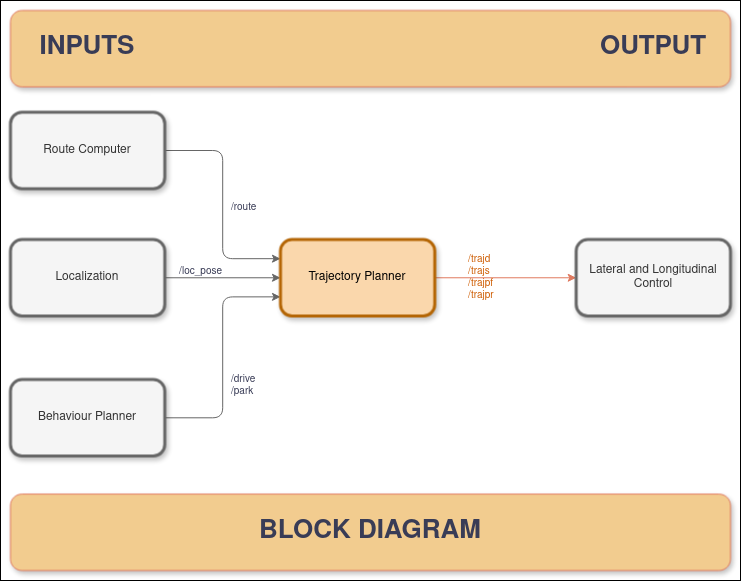

## Component Description
The trajectory planner take care of smoothing the path generated by the path planning component(adapt_roucomp) with the help of interpolation, cubicspline has been implemented to carry out this task. The component also calculate the parking maneuver through circles and line segments.

| In/Out | Topic Name| Message Type | Description | 
| --------- | ---------- | ---------- | ----------- |
| Input | /route| PoseArray | A optimum route from the ego vehicle's initial parking location to the parking spot | |
| Input | /loc_pose | PoseStamped |Location of ego Vehicle | |
| Input | /euler_angles | Vector3 |orientation of the ego vehicle| |
| Input | /drive | Bool | state of the vehicle to drive  | 
| Input | /park | Bool | state of the ego vehicle to start park | 
| Input | /park_reverse | Bool |state of the ego vehicle to actuate reverse after aligning itself for the spot|
| Output | /trajd | JointTrajectory | trajectory with positions and associated velocities for drive state |
| Output | /trajs | JointTrajectory | trajectory with positions and associated velocities for stop state  |
| Output | /trajpf | JointTrajectory | trajectory with positions and associated velocities for forward parking state |
| Output | /trajpr | JointTrajectory | trajectory with positions and associated velocities for reverse parking state|

## The parking maneuver concept



The parking is designed in five phases:-

1. forward straight(initp and interp2)
2. forward circle(interp1 to interp2)
3. forward straight(interp2 to crossp)
4. reverse circle(crossp to destp)
5. reverse straight(destp to goalp)

The design include the use of two circles with same radius and line drawn form interp at an angle of theta, both of the circles have one tangent at the line and one tangent on vertical and horizontal lines respectively. the first circle arc is formed between the tangents of the first circle and second arc between the tangents of the second circle. 

## Trajectory planner block diagram

 

 ## Functionality
 The behaviour planning node need two inputs to get the vehicle postion, orientation and route data, there are also five state inputs from the behaviour planning component (adapt_behplan). All imputs are crucial for the component to work:
 
 The functions are as follows:
 1. The functions loc_callback(),path_callback() and yaw_callback() store the location data, route data and yaw angle from the subscriptions.
 2. The functions The drive_callback(), park_forward_callback(), park_reverse_callback store the boolean messages and set conditons how to execute the trajectory calculations.
 3. The smooth_trajectory() function carry out the task of interpolation of the route to make it smoother for the ego vehicle to traverse.
 4. The function generate_parking_trajectory() sets the points the component require to correctly calculate the parking maneuver. It also use mathematical functions defined in the same code.
 5. The forward_park_path_publisher() and reverse_park_path_publisher() functions fill the JointTrajectory message to publish with different topics.
 6. The generate_straight_line(), calculate_point_on_line() and generate_circular_arc() are the mathematical functions designed to calculate line segments, circular arc and a point on a line segment.
 7. The stop_car() function fills the JointTrajectory message with 0.0 

 ## Dependencies
 1. adapt_roucomp
 2. adapt_loc
 3. adapt_behplan

 ## Installation Instructions

To install the trajectory planner package, do follow the steps below:

### Step 1: create src folder

Open the terminal, navigate to the workspace and create a 'src' directory where you want to clone the repository. 

```shell
mkdir src
```
### Step 2: clone the repository
Navigate to 'src' and follow the given command to clone the repository.
```shell
git clone https://git.hs-coburg.de/ADAPT/adapt_behplan.git
```
### Step 3: build the package
After cloning the repository, navigate back to the workspace
```shell
cd ..
```
Now, build the package using **`colcon`**:
```shell
colcon build --symlink-install
```
### Step 4: Source the setup file
Once the build is complete, you'll need to source the workspace to make it available to ROS2:
```shell
. install/setup.bash
```
### Step 4: Run the node
use the command below in the workspace to run the node 
```shell
ros2 run adapt_trajp traj
```
